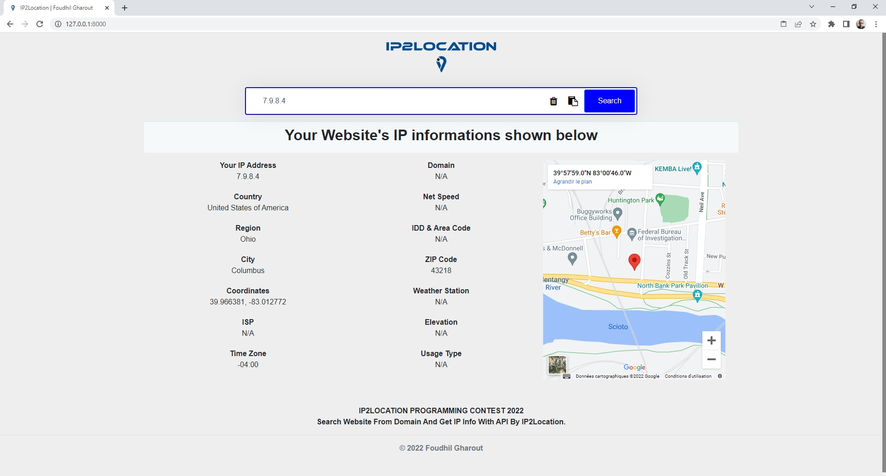
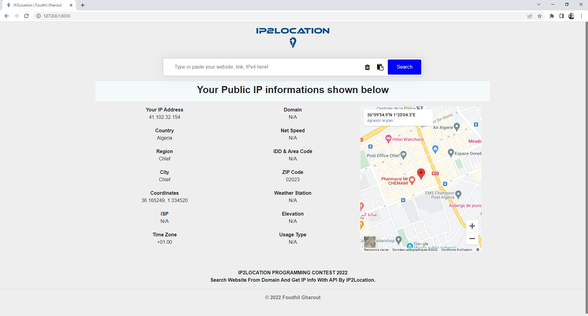

<a id="readme-top"></a>
<br />
<div align="center">
  <a href="https://github.com/wufoudhil/ip2location_Foudhil-Gharout">
    
  </a>

  <h3 align="center">IP2Location Contest 2022</h3>

  <p align="center">
    Search Website From Domain And Get IP Info With API By <a href="https://www.ip2location.com"><strong>IP2Location</strong></a> using Python 3.x
  </p>
</div>

<details>
  <summary>Table of Contents</summary>
  <ol>
    <li>
      <a href="#about-the-project">About The Project</a>
      <ul>
        <li><a href="#built-with">Built With</a></li>
      </ul>
    </li>
    <li>
      <a href="#getting-started">Getting Started</a>
      <ul>
        <li><a href="#prerequisites">Prerequisites</a></li>
        <li><a href="#installation">Installation</a></li>
      </ul>
    </li>
    <li><a href="#usage">Usage</a></li>
    <li><a href="#license">License</a></li>
    <li><a href="#contact">Contact</a></li>
  </ol>
</details>

# About The Project

<div align="center">
  <a href="https://github.com/wufoudhil/ip2location_Foudhil-Gharout">
    
  </a>
  <h4 align="center">IP2Location Contest 2022 By Foudhil Gharout</h4>
</div>
</br>

Web Application used to geolocalize a domain's IP and get many usefull informations like Country, Region, Time Zone, Zip Code ... etc, the Application generate these informations using a lite IP2LOCATION database, so some other informations are not avilable in this version of database. Anywhay you can use a full version if you have one just replace the `IP2LOCATION-LITE-DB11.BIN` database file in `data` folder with yours and you can benifit of all informations.

<p align="right"><a href="#readme-top">Top</a></p>


### Built With

The main core of this work is:

* [](https://www.python.org/)
* [](https://www.djangoproject.com/)
* [](https://dev.w3.org/html5/spec-LC/)
* [](https://getbootstrap.com/)
* [](https://jquery.com/)

<p align="right"><a href="#readme-top">Top</a></p>


## Getting Started

Download or just clone the repo to your local machine

```sh
$ git clone https://github.com/wufoudhil/ip2location_Foudhil-Gharout
``` 

<p align="right"><a href="#readme-top">Top</a></p>

### Prerequisites

Install the required Python packages for the first use

```sh
$ pip install -r requirements.txt
``` 

The above command will install the following packages:

```
Django v4.0.3
IP2Location v8.8.0
requests v2.27.1
```

<p align="right"><a href="#readme-top">Top</a></p>

### Installation

No real action is needed just ``` cd ``` to the app root with your Terminal/Command prompt and run ``` py manage.py runserver ``` and enjoy the app.

- `IP2LOCATION Database file`: If you provide a Licensed IP2LOCATION Database you can use it, just replace the LITE version in `data` folder with it and change the line 16 in ``` ip2location/views.py ```:
  ``` 16   database = IP2Location.IP2Location(os.path.join("data", "IP2LOCATION-LITE-DB11.BIN")) ```

<p align="right"><a href="#readme-top">Top</a></p>

## Usage

When run the server visit your localhost and you'll get your Public IP informations and location map

<div align="center">
  
  <p align="center">IP2Location Contest 2022 | Home page</p>
</div>
</br>

and if you want to try some IPv4, website link or domain just type/paste it in the input and Go

<p align="right"><a href="#readme-top">Top</a></p>

## License

This is free software, licensed under the GPL v3 [license](LICENSE/LICENSE).

<p align="right"><a href="#readme-top">Top</a></p>

## Contact

<div align="center">
Foudhil Gharout </br> [wufoudhil](https://twitter.com/wufoudhil)  [foudhil-gharout](https://www.linkedin.com/in/foudhil-gharout/)</br> wufoudhil@gmail.com
</div>

<p align="right"><a href="#readme-top">Top</a></p>


[linkedin-shield]: https://img.shields.io/badge/-LinkedIn-black.svg?style=for-the-badge&logo=linkedin&colorB=555
[linkedin-url]: https://linkedin.com/in/linkedin_username
